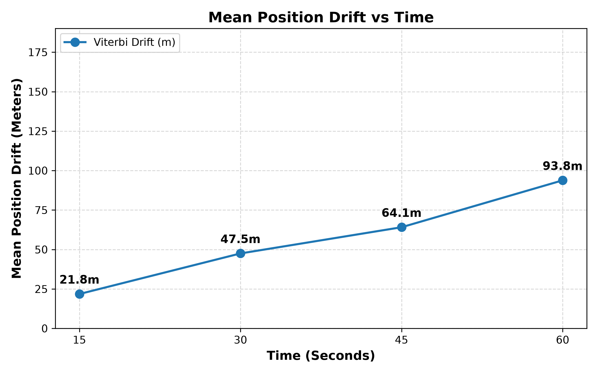
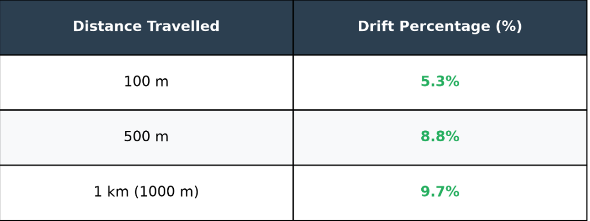
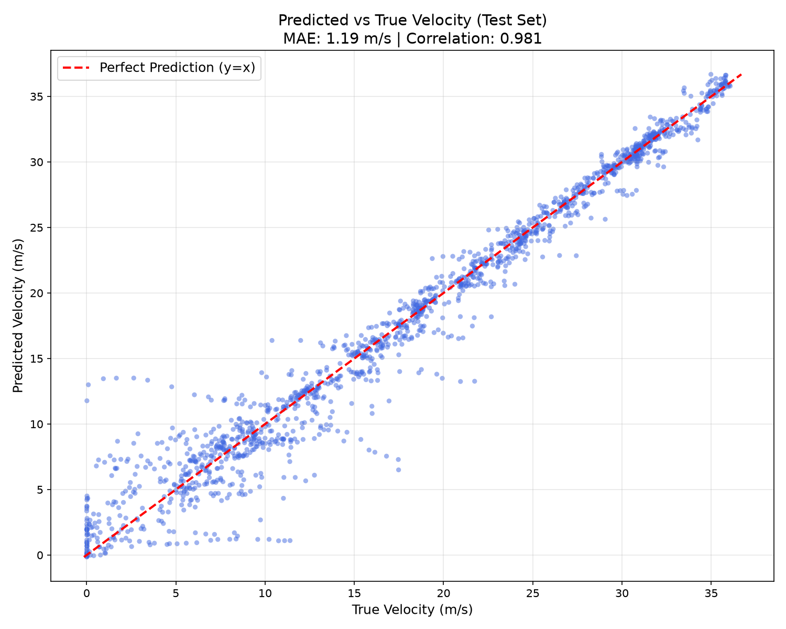
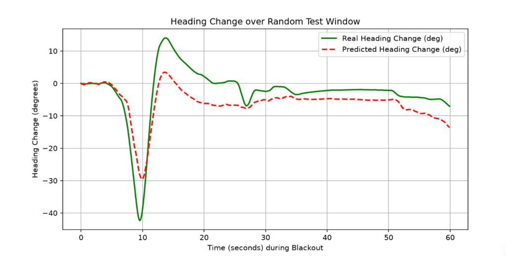

# IO-VNBD: Inertial Odometry for Vehicle Navigation during Blackouts

This repository contains the training, evaluation, and deployment pipeline for a robust inertial navigation system designed to provide continuous vehicle tracking during GPS signal loss (blackouts).

## General Architecture
The system relies on a fused Dead-Reckoning (DR) engine utilizing two primary deep learning components alongside physical kinematics and map-matching logic:

1. **Deep Velocity Speed Estimator (DVSE):**
   - Ingests raw IMU data (Accelerometer and Gyroscope) and pre-integrates it.
   - Passes the extracted features through a Motion Tracking Network (MTN) and a Non-holonomic Constraint Network (NCN).
   - Fuses physical kinematic constraints directly into the deep learning pipeline via a custom physics layer to predict 1Hz vehicle velocity.

2. **GyroTCN (Heading Estimator):**
   - A Temporal Convolutional Network (TCN) designed to denoise uncalibrated smartphone gyroscope signals.
   - Predicts the true vehicle yaw rate by correcting for sensor misalignment, bias, and drift.

3. **Trajectory Fusion & Viterbi Map Matching:**
   - Integrates the predicted 1D velocity and 1D yaw rate to generate a local 2D Dead-Reckoning (DR) trajectory.
   - Applies a Hidden Markov Model (HMM) Viterbi algorithm using a spatial KDTree to snap the raw dead-reckoning predictions onto the known road network, drastically reducing cumulative cross-track drift.

## Repository Structure

```text
.
├── data/                  # Dataset generation, precalculation, and preprocessing routines
├── model/                 
│   ├── heading/           # GyroTCN model architecture (heading_estimator.py)
│   └── velocity/          # DVSE model architecture (feature_extractor, physics_layer, velocity_components)
├── train/                 
│   ├── heading/           # Training scripts for the GyroTCN model
│   └── velocity/          # Training scripts for the DVSE model
├── onnx/                  
│   ├── model/             # Exported ONNX weights (.onnx) for mobile deployment
│   └── script/            # Scripts to export trained PyTorch models to ONNX
└── evaluation/            # Scripts for evaluating checkpoints (drift, scatter, trajectories)
    └── plots/             # Output plots, evaluation metrics, and interactive maps
```

## Training Script Reproduction

To train the models from scratch using the precalculated dataset, navigate to the respective training directories and run the training scripts. The codebase is configured to automatically resolve internal imports from anywhere in the tree.

**Train the Velocity Model (DVSE):**
```bash
cd train/velocity
python train.py --data-dir ../../data --epochs 40
```

**Train the Heading Model (GyroTCN):**
```bash
cd train/heading
python train.py --data-dir ../../data --epochs 50
```

## Evaluation & Results

The evaluation pipeline tests the models over various 60-second complete GPS blackout windows.

### 1. Cumulative Drift Analysis
*This plot illustrates the cumulative positional error (drift) over time during GPS blackouts, comparing raw dead-reckoning vs map-matched dead-reckoning.*



### 2. Drift Percentage by Distance
*The table below highlights the percentage of accumulated drift relative to the total distance traveled during the blackout.*



### 3. Velocity Prediction Accuracy
*Scatter plot comparing the DVSE model's predicted velocity against the true ground truth vehicle velocity. Demonstrates strong correlation with minimal mean absolute error (MAE).*



### 4. Heading Prediction (GyroTCN)
*Line graph illustrating the integrated heading change over a random 60-second test window. It compares the ground truth heading change against the denoised predictions from the GyroTCN model.*


